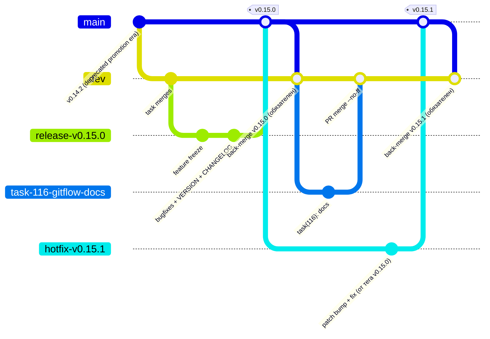

# GITFLOW.md — модель веток и релизный цикл Orenda

> **TL;DR.** Гибрид `main` + `dev`: **не** канонический git-flow Дриссена и **не**
> trunk-based. Вся разработка идёт короткоживущими `task-*` ветками → PR в `dev`
> (интеграционный транк). Релизы собираются на канонических `release-*` ветках
> (`dev` → `main` + тег), хотфиксы — на `hotfix-*` от тега на `main`. У обоих
> циклов обратный мерж в `dev` **обязателен**. Для агентов: см.
> [«Git для AI-агентов»](#git-для-ai-агентов), механика worktree — `AGENTS.md`
> «Worktree per task».

## Общая схема



Исторические прецеденты. Канон по целевой модели — один: `release-v0.15.0`
→ PR #143 → `main` → тег `v0.15.0` (тег на merge-коммите `237b4bf`), но шаг
«обратный мерж в `dev`» и здесь пропущен (см. ниже). Эпоха v0.14.x работала
иначе — двухступенчатой транспортной схемой: `release-vX.Y.Z` → PR в `dev`
(#136, #140, base=`dev`), затем «транспортная» `promotion-*` от `dev`
(уже содержащая release-контент) → PR в `main` + тег (#137, #141,
base=`main`). Обратный мерж `main` → `dev` в ту эпоху не выполнялся.

## Таблица веток

| Тип ветки | Откуда | Куда (`--no-ff`) | Именование | Тег | Обратный мерж | Время жизни |
|---|---|---|---|---|---|---|
| Feature / task | `origin/dev` (никогда не от локального `dev`, не от `main`) | `dev` через PR; мержит владелец после PM-review | `task-123-short-slug` (123 — номер задачи) | нет | не требуется | часы–дни |
| Release | `dev` в момент freeze фич | `main` через PR; ветка удаляется после финиша | `release-vX.Y.Z` | `vX.Y.Z` на merge-коммите в `main` | **обязателен** в `dev` | дни |
| Hotfix | `main` — от тега проблемного релиза (никогда не от `dev`) | `main` через PR; исключение — см. ниже; ветка удаляется после финиша | `hotfix-vX.Y.Z` | патч-тег `vX.Y.(Z+1)` в `main` | **обязателен** в `dev`; при открытой `release-*` — сначала в неё | часы |
| ~~Promotion~~ (устарело) | — | `main` мимо `dev` | ~~`promotion-vX.Y.Z`~~ | — | не выполнялся (`main`→`dev`); контент попадал в `dev` обходным путём, но графы разошлись | запрещено, см. [«Устаревшие практики»](#устаревшие-практики) |

Запреты, действующие везде: фичи от `main`; хотфиксы от `dev`; прямые пуши в
`main`; мержи агентами (мержит только владелец после approve-ревью PM);
удаление чужих long-lived веток (`main`, `dev`, открытых `release-*`).

## Release-цикл пошагово

1. **Freeze** — фичи больше не принимаются в грядущий релиз; от свежего
   `origin/dev` ветвится `release-vX.Y.Z`.
2. **Стабилизация на ветке** — только багфиксы и метаданные релиза: bump
   `VERSION`, свёртка `## [Unreleased]` в `CHANGELOG.md`. Новые фичи в ветку не
   попадают — они ждут следующего цикла в `dev`.
3. **Финиш** — merge `--no-ff` в `main` через PR (прецедент: `release-v0.15.0`
   → PR #143) + тег `vX.Y.Z` на merge-коммите. Теги `vX.Y.Z` живут только на
   `main`.
4. **Обратный мерж — обязателен.** `main` (с новым тегом и метаданными) мержится
   обратно в `dev`, иначе `VERSION`/`CHANGELOG.md` расходятся, а следующий цикл
   стартует от устаревшей базы. Единственный в истории репо выполненный
   прецедент — `3e33309` (sync v0.2.0 release back into `dev`); после v0.14.1
   и v0.15.0 шаг не выполнялся — см. «Системная недовыполняемость» ниже.
5. **Ветка удаляется** (`git push origin --delete release-vX.Y.Z` +
   локальная, если была) — после финиша она не нужна.

> **Системная недовыполняемость шага.** В истории репо back-merge `main` →
> `dev` после релиза не выполнен даже в каноническом цикле: `v0.15.0` **не
> является предком** `dev` (`git merge-base --is-ancestor v0.15.0 origin/dev`
> → `false`). Перед следующим freeze разрыв нужно закрыть — `main` в `dev`
> через PR (fast-forward не сработает, графы уже разошлись).

## Hotfix-цикл пошагово

1. **Ветвление от `main`, от тега проблемного релиза** — не от `dev`: чинить
   нужно то, что реально работает в production, а `dev` может уже уехать
   вперёд.
2. **Патч-бамп + фикс**: `vX.Y.Z` → `vX.Y.(Z+1)`, минимальный дифф, только
   починка.
3. **Финиш** — merge `--no-ff` в `main` через PR + патч-тег `vX.Y.(Z+1)`.
4. **Обратный мерж — обязателен**, в `dev` (тот же аргумент, что и у релиза).

   **Исключение:** если в этот момент открыта ветка `release-*`, обратный мерж
   делается **сначала в неё**, затем в `dev` — иначе незакрытый релиз, смёрженный
   в `main` позже хотфикса, откатит фикс.

   ```mermaid
   gitGraph
      checkout main
      commit id: "v0.15.0"
      branch dev
      checkout dev
      commit id: "task merges"
      branch release-v0.16.0
      checkout release-v0.16.0
      commit id: "freeze + stabilization"
      checkout main
      branch hotfix-v0.15.1
      commit id: "fix (от тега v0.15.0)"
      checkout main
      merge hotfix-v0.15.1 tag: "v0.15.1"
      checkout release-v0.16.0
      merge hotfix-v0.15.1 id: "back-merge СНАЧАЛА сюда"
      checkout dev
      merge main id: "затем back-merge в dev"
   ```

5. **Ветка удаляется** после финиша. Брошенные хотфикс-ветки — мусор в remote:
   пример — `fix-tag-v0.15.0` из старой хотфикс-практики, пришлось вычищать.

## Git для AI-агентов

Полная механика worktree — `AGENTS.md` «Worktree per task» (обязательно,
без исключений); здесь — как она сочетается с ветвлением.

- **Isolation = worktree per task.** Параллельные агенты не видят друг друга.
  У каждого своя ветка `task-123-short-slug` от `origin/dev`, свой чекаут в
  `.worktrees/<task>/`, свой preview-порт из **21400–21499** (`:2137` — usage,
  `:2138` — `make dev`, `:21371` — E2E, заняты), своя `data/orenda.db` на
  ворктри. Гейт-хуки наследуются из shared git config — `make hooks`
  переустанавливать не нужно.
- **Мелкие батчи, частые коммиты.** Ветка живёт часы, не недели; агент не копит
  большой дифф — большой дифф конфликтует с работой каждого другого агента и
  не проходит ревью. Незакоммиченное в общем чекауте не защищено.
- **Локальные гейты до push.** Гейт PR — хуки, не CI: `pre-commit` (gofmt +
  prettier) и `pre-push` (`make lint-new` + `make web-typecheck` +
  `make test`). Агент **не ждёт CI**: PR в `dev` молчит по дизайну.
  `--no-verify` запрещён (исключение — `SKIP_ORENDA_HOOKS=1` с фиксацией в PR).
- **Синхронное ревью.** PR открывается по готовности ветки, PM ревьюит сразу,
  мержит владелец после approve. PR не копятся; агент свой PR не мержит.
- **Очистка.** После мержа: `git worktree remove` + `git worktree prune`;
  своя remote-ветка, если пережила мерж, удаляется. Брошенная ветка — мусор
  (пример: `fix-tag-v0.15.0`, артефакт старой хотфикс-практики). За гигиеной
  дерева следит PM.

## Устаревшие практики

**Promotion-схема эпохи v0.14.x (`promotion-v0.14.1`, `promotion-v0.14.2`) —
устарела и запрещена.**

- **Что было:** релизный контент уже собирался на `release-vX.Y.Z`, но в
  `main` попадал через двухступенчатую транспортную схему: `release-vX.Y.Z`
  → PR в `dev` (#136, #140), затем ветка `promotion-*` от `dev` → PR в `main`
  + тег (#137, #141). Обратного мержа `main` → `dev` схема не имела.
- **Почему сломалось:** графы `main` и `dev` разошлись — merge-коммиты
  promotion-PR (#137, #141) и их теги (`v0.14.1`, `v0.14.2`) так и не стали
  предками `dev` (`git merge-base --is-ancestor v0.14.2 origin/dev` →
  `false`). Контент при этом не потерян: `git log origin/dev..origin/promotion-*`
  пуст — всё добралось в `dev` обходным путём (release-* → dev), но сам `main`
  (теги/merge-коммиты) в `dev` не синхронизировался, и git-графы разошлись.
  Сами promotion-ветки до сих пор висят в remote как неубранный мусор.
- **Что теперь:** релизы — по release-циклу выше (`release-vX.Y.Z` → `main`
  + тег + **обязательный** обратный мерж в `dev`; канонический пример —
  `release-v0.15.0` → PR #143 → `v0.15.0`, правда, без выполненного
  back-merge — см. «Системная недовыполняемость»). Не резюмецировать
  `promotion-*` ни для новых релизов, ни для хотфиксов; в `main` — только
  через `release-*` / `hotfix-*`.

Заметка о `docs/RELEASE.md`: операционные шаги релиза (CHANGELOG, `VERSION`,
`make lint-new BASE_REF=origin/main` + `make test-full`, тег, GitHub Release,
`update-dogfood.sh`) описаны там и остаются в силе. Модель ветвления в
`RELEASE.md` (шаг 2, «промоушн `dev` → `main` через PR») устарела и заменяется
release-ветками по этому документу; `RELEASE.md` — снапшот (при расхождении
правит wiki), синхронизация — при ближайшем релизе.

## Связанные документы

- `AGENTS.md` — локальные гейки (pre-commit/pre-push, «Agent does not wait on
  CI»), worktree per task, запреты.
- `docs/DOGFOOD.md` — откуда берётся работа и цикл ревью (PM-review, мерж
  владельцем, QA-гейт).
- `docs/RELEASE.md` — операционные шаги релиза и versioning (снапшот;
  модель ветвления см. здесь).
